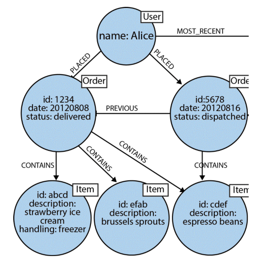

# Introduction

---
## Why graph databases?
- Over 300 years history of graph theory!
- **Facebook:** discrete information about people is important, but *relationships* among them (the *social graph*) is more. 
- **Google:** Store and process discrete documents is fine, the *web graph* that encodes relationships among them is where the value is.

---
## But what is a graph?
- Collection of *vertices* (*nodes*) and *edges* (*relationships*).
- Vertices represent entities of the real world, and edges the relationship between them.
- **Examples**

---
## Labeled Property Graph Model

- It contains nodes and relationships. 
- Nodes contain properties (key-value pairs). 
- Nodes can be labeled with one or more labels. 
- Relationships are named and directed, and always have a start and end node. 
- Relationships can also contain properties.

---
# Data Storage

---
## Storing connected data
- Mechanical tapes.
- **Relational databases.**
	- Excellent option for storing tabular data.
	- Multiple data sources and their relationships (PK, FK).
	- *But* not very easy to handle relationships between entities.

---
## Relational DBs downsides
- Heavily normalized schema leads to small join tables.
- Expensive joins are needed for some queries (purchase history).
- *Which customers bought this product?* is expensive, and *which customers buying this product also bought that product?* is even worse!

---
## Data revolution

As more data is stored, better storage methods are needed.
- **Performance:** improve indices.
- **Developer Experience:** document databases a partial solution.

Graph databases improve performance *and* developer experience!

---
## Performance boost?
Partner and Vukotic's experiment: 
- Social network with 1 million people.
- Each of them with around 50 friends.
- **Goal:** Find *friends of friends* on the database (up to depth 5).

---
## Results

| Depth | RDBMS (seconds) | Neo4j (seconds) | Approx. Records |
|-------|-----------------|-----------------|-----------------|
| 2 | 0.016 | 0.01 | 2,500 |
| 3 | 30.267 | 0.168 | 110,000 |
| 4 | 1543.505 | 1.359 | 600,000 |
| 5 | Unfinished | 2.132 | 800,000 |

---
## Another example: online retail

